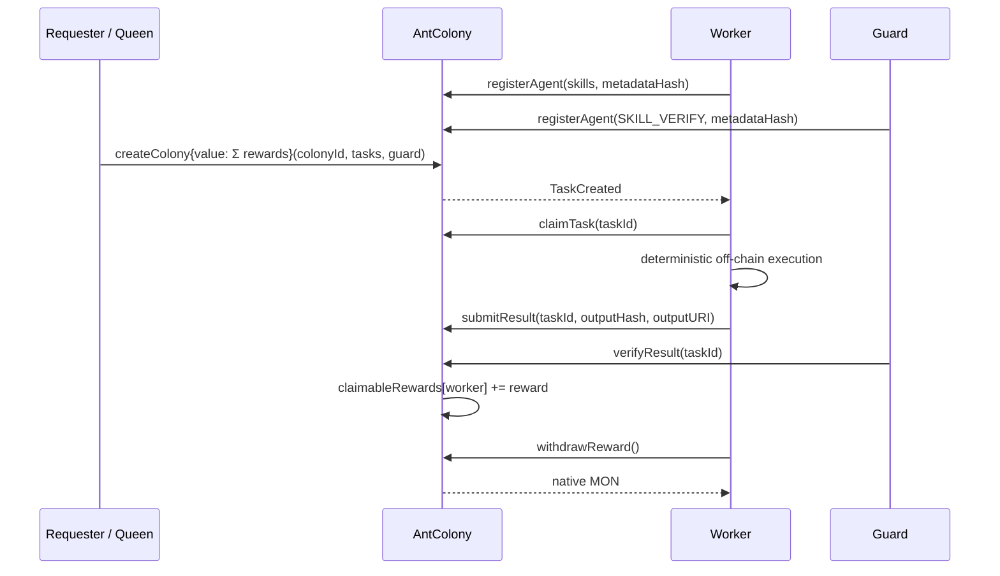

<div align="center">

# AntForge on Monad

**Monad 沙丘上的 Agent 蚂蚁工坊**

一个目标，多只 Agent，一套由 Monad 托管与结算的自治协作经济。

[](https://antforge-monad.vercel.app/)
[](https://testnet.monadexplorer.com/address/0x028268f8fF62edc596f931E17E2Fb21015f5b0A2)
[](contracts/src/AntColony.sol)
[](web/package.json)
[](web/package.json)
[](web/package.json)

[公网 Demo](https://antforge-monad.vercel.app/) · [合约](https://testnet.monadexplorer.com/address/0x028268f8fF62edc596f931E17E2Fb21015f5b0A2) · [链上证据](docs/04-monad-testnet-evidence.md) · [3 分钟路演稿](docs/06-roadshow-cue-card.md) · [前端演示步骤](docs/07-frontend-demo-walkthrough.md)

</div>

> 公网 Demo 默认运行于 **Live Settlement**：读取 Monad Testnet 的真实合约与事件，并可由连接的钱包创建 Colony。Agent 的图片/文本输出仍是明确标注的 deterministic mock；链上身份、托管、状态、回执与 MON 结算是真实测试网行为。

---

## 30 秒看懂项目

传统 Agent 产品通常把重点放在「选择一个 Agent」。AntForge 处理的是另一类问题：**当一个目标需要多只自治 Agent 分工时，如何在没有中心化调度账本的情况下完成技能匹配、并发执行、结果承诺、验证与按贡献结算？**

用户提交目标并锁定原生 **MON**；Queen 将目标拆成任务级隔离的微任务；具备匹配技能的 Worker 领取并提交结果哈希；Guard 验证后把奖励记入 Worker 的独立余额，Worker 再自行提取 MON。

```text
Goal + MON escrow
  → Queen creates isolated taskIds
  → skill-matched Workers claim and commit outputs
  → Guard verifies or rejects
  → claimableRewards[worker]
  → Worker withdraws native MON
  → receipts and state remain verifiable on Explorer
```

| 评审问题 | AntForge 的回答 |
| --- | --- |
| **解决什么问题？** | 多 Agent 临时组队缺少可验证、可结算的协作协议 |
| **核心创新？** | Swarm / Conflict 双通道、链上技能位图、确定性任务 ID、Pull 奖励 |
| **为什么是 Monad？** | Agent 协作天然产生大量彼此独立的微交易，适合低冲突、任务级状态设计与快速事件反馈 |
| **已完成什么？** | 合约、Foundry 测试、事件驱动 Runner、Mock/Live 前端、Vercel 公网部署、Testnet 全闭环与 Explorer 证据 |
| **哪些仍是 Mock？** | Queen 规划模板与图片/文本输出；所有 Mock 均在界面和文档中明确标注 |

---

## 已交付功能

### 智能合约

- Agent 注册、资料哈希与技能位图；
- 单个 Colony 最多创建 `8` 个独立任务，并精确托管奖励总和；
- Requester 命名空间下的确定性 `taskId`，无需全局自增计数器；
- `Open → Claimed → Submitted → Settled` 主状态机；
- Guard 拒绝并退款、Requester 超时取消并退款；
- `claimableRewards` Pull 结算与 Worker 原生 MON 提款；
- 技能、Worker、Verifier、Requester 权限检查；
- OpenZeppelin `ReentrancyGuard` 保护资金路径；
- 禁止绕过 Colony 流程直接向合约打款。

### Agent Runtime

- Repair、Color、Story、Guard、Rogue 使用独立测试网钱包；
- 持久监听 `TaskCreated`，自动领取、提交、验证、结算和提款；
- 重启后从链上状态恢复 `Open / Claimed / Submitted / Settled` 任务；
- 按 Worker 串行、跨 Worker 并行处理，Guard 使用独立队列；
- 交易在广播前持久化 nonce、原始签名交易和预计算哈希；
- 对模糊 RPC 响应执行回执协调或同原始交易重播，避免盲目创建第二笔业务交易；
- Monad 公共 RPC 日志查询按 `100` 区块分页，并以有界并发回放。

### Web App

- 同一套领域模型与组件支持 `mock` / `live` 两种数据源；
- 生产部署默认 **Live Settlement**，开发环境默认 Mock（除非显式配置）；
- 注入式钱包连接、Monad Testnet 网络检查与 `createColony` 写入；
- 从合约事件重建最新 Colony、任务、Agent、预算和状态；
- 蚁穴拓扑、任务工坊、工作流、Proof Lanes、事件流与 Explorer 链接；
- Mock / Live、Runner 状态、交易哈希、区块、Gas Limit 与 inclusion latency 清晰展示；
- Live 失败时展示真实错误，不静默回退到 Mock。

---

## Monad 原生机制

| 机制 | 实现 | 可验证结果 |
| --- | --- | --- |
| **Swarm Lane** | `mapping(bytes32 taskId => Task)`；不同 Worker 写不同任务槽 | 多任务可独立领取、提交与结算；避免共享全局任务计数器 |
| **Conflict Lane** | 同一 `taskId` 的 `Open` 状态是排他资源 | 第一位 Worker 成功，第二笔交易以 `TaskNotOpen` 回滚 |
| **Skill Guard** | `agents[worker].skills & task.requiredSkill` | Rogue Ant 在广播前模拟即得到 `SkillMismatch` |
| **Pull Settlement** | `claimableRewards[worker]` + `withdrawReward()` | Guard 只记账，Worker 独立提款，降低验证流程的外部调用风险 |
| **Pheromone Events** | Colony / Task / Result / Reward 全流程事件 | 前端与 Runner 可通过日志回放和增量轮询恢复状态 |
| **Deterministic IDs** | `keccak256(requester, colonyId, index, inputHash)` | 任务由上下文唯一派生，不依赖共享 `nextTaskId++` |

这里的「并行友好」描述的是**状态结构设计**，不是未经测试的 TPS 或并行性能结论。延迟指标表示广播到一确认回执的 inclusion latency，不等同于 finality。

---

## 完整协议流程



失败与退款路径：

```text
Submitted --rejectAndRefund--> Rejected  --MON--> Requester
Expired Open / Claimed / Submitted --cancelExpiredTask--> Cancelled --MON--> Requester
```

---

## 系统架构

```text
┌────────────────────────────────────────────────────────────────┐
│ web/  React 19 + Vite 8 + TypeScript + wagmi + viem           │
│       MockColonyDataSource  │  MonadColonyDataSource           │
│       wallet writes · event replay · colony dashboard          │
└──────────────────────────────┬─────────────────────────────────┘
                               │ public RPC + Requester wallet
┌──────────────────────────────▼─────────────────────────────────┐
│ AntColony.sol · Monad Testnet 10143                            │
│ agents · tasks · colonyRequesters · claimableRewards           │
│ escrow · permissions · state machine · events · native MON     │
└──────────────────────────────┬─────────────────────────────────┘
                               │ events + local-only role keys
┌──────────────────────────────▼─────────────────────────────────┐
│ agents/  Node.js + TypeScript + viem                           │
│ Repair · Color · Story · Guard · Rogue                         │
│ backfill · polling · recovery journal · reconciliation         │
└────────────────────────────────────────────────────────────────┘
```

| 层 | 技术 | 职责 |
| --- | --- | --- |
| Contract | Solidity `0.8.28`、Monad Foundry、OpenZeppelin | 身份、技能、托管、状态机、退款与结算 |
| Runtime | Node.js `20+`、TypeScript、viem | 多钱包事件驱动执行与可靠交易广播 |
| Frontend | React `19.2`、Vite `8.1`、Tailwind CSS `4.3`、wagmi `3.7`、viem `2.55` | 双模式看板、钱包操作与链上证据 |
| Network | Monad Testnet，Chain ID `10143` | 合约字节码、事件、回执与原生 MON |
| Hosting | Vercel | 静态 Web App；不托管 Agent 私钥或 Runner |

### Mock / Live 真实性边界

| 能力 | Mock | Live |
| --- | --- | --- |
| UI、领域模型、任务状态机 | 共用 | 共用 |
| Queen 三任务规划 | 确定性模板 | 确定性模板 |
| 图片 / 文本输出 | 确定性 Mock | 确定性 Mock |
| 钱包签名与交易 | 浏览器模拟 | **真实 Testnet** |
| 托管、奖励与 MON | 模拟并明确标注 | **真实 Testnet** |
| 哈希、区块与 Explorer | 不伪造 | 来自 RPC、回执与日志 |
| 错误处理 | 可控演示 | 展示真实错误，禁止静默回退 |

---

## Monad Testnet 部署与证据

机器可读记录：[`deployments/monad-testnet.json`](deployments/monad-testnet.json)

完整证据说明：[`docs/04-monad-testnet-evidence.md`](docs/04-monad-testnet-evidence.md)

| 项目 | 已验证值 |
| --- | --- |
| 网络 | Monad Testnet · Chain ID `10143` |
| 合约 | [`0x028268f8fF62edc596f931E17E2Fb21015f5b0A2`](https://testnet.monadexplorer.com/address/0x028268f8fF62edc596f931E17E2Fb21015f5b0A2) |
| 部署交易 | [`0xf0567983…f941a00c`](https://testnet.monadexplorer.com/tx/0xf0567983d07c3a5811d603612defb71b188856b44db840b895e164e4f941a00c) |
| 部署区块 | `47924433` |
| Runtime code | `5388` bytes |
| 源码验证 | MonadVision Sourcify `exact_match` |
| Public Demo | [https://antforge-monad.vercel.app/](https://antforge-monad.vercel.app/)（默认 Live Settlement） |

### 主闭环交易

以下交易在 Monad Testnet 上组成 Repair Worker 的纵向结算切片：

| 步骤 | 交易 | 回执 |
| --- | --- | --- |
| 创建 Colony，托管三份 `0.001 MON` | [`0xd7b5690c…40574763`](https://testnet.monadexplorer.com/tx/0xd7b5690c0781520d8750d50aac3b6733735a98a7f091bac1232669f940574763) | Success |
| Repair 领取任务 | [`0xf0c11cff…9c57f9a`](https://testnet.monadexplorer.com/tx/0xf0c11cffbb2ea79b713d7b1fb6bd757361fa1622a4ba2ebe363a0b2c29c57f9a) | Success |
| 提交结果承诺 | [`0x2687798b…730f433c`](https://testnet.monadexplorer.com/tx/0x2687798b5e875ccf3abc26cb1469d4fb1d798e7e39a3ccbb14158697730f433c) | Success |
| Guard 验证并记账 | [`0xc6c8d640…dc42987e`](https://testnet.monadexplorer.com/tx/0xc6c8d6401ed2e6374660b5e6d1235cd441536cbe17dbacdaa8c5b671dc42987e) | Success |
| Worker 提取 MON | [`0xba439f5f…fb0da2c7`](https://testnet.monadexplorer.com/tx/0xba439f5fa3eb5b76283ae5c88eaa91779ac89bb4c6338fd482008f25fb0da2c7) | Success |

结算后记录的 RPC 状态：任务为 `Settled`、Worker `claimableRewards = 0`、合约余额 `0`。

### 失败路径证据

- **Conflict Lane：** [赢家领取成功](https://testnet.monadexplorer.com/tx/0x1d632ec74a9e8e61748bf7912d2744ab72e128f53e9219ccc77fbe5f8c3743d1)，[竞争方交易回滚](https://testnet.monadexplorer.com/tx/0x5c8f5070a5db880178220027a4eeb6d3f6e725be2888cae745996643cb9b4061)，错误为 `TaskNotOpen`。
- **Skill Guard：** Rogue Ant 在广播前模拟得到 `SkillMismatch`，因此没有交易哈希；项目不会为未广播操作伪造链上证据。

---

## 快速开始

### 环境要求

- Node.js `20+`；
- npm；
- [Monad Foundry](https://docs.monad.xyz/developer-essentials/developer-tools/foundry)（本项目验证版本 `1.7.1-monad-v1.0.0`）；
- Live 模式需要 MetaMask / Rabby 等注入式钱包与少量 Testnet MON；
- 部署或运行 Agent 需要**专用测试网钱包**，不得使用主网私钥。

### 克隆与全量校验

```bash
git clone https://github.com/NeoWeb3Nova/monad-agent-ant-workshop.git
cd monad-agent-ant-workshop
git submodule update --init --recursive

cd contracts
forge fmt --check
forge build --sizes
forge test -vv
cd ..

cd agents
npm ci
npm run typecheck
npm run build
cd ..

cd web
npm ci
npm run lint
npm run build
cd ..
```

### Web：Mock 模式

```bash
cd web
cp .env.example .env
# 保持 VITE_DATA_MODE=mock
npm ci
npm run dev
```

访问 `http://localhost:5173`，点击 **Release the swarm** 可离线演示完整视觉状态机。Mock 不生成伪造的交易哈希或区块号。

### Web：Live Settlement

编辑 `web/.env`：

```dotenv
VITE_DATA_MODE=live
VITE_MONAD_RPC_URL=https://testnet-rpc.monad.xyz
VITE_CHAIN_ID=10143
VITE_ANT_COLONY_ADDRESS=0x028268f8fF62edc596f931E17E2Fb21015f5b0A2
VITE_GUARD_ADDRESS=0xD6BFA77F707662A74CdA7C21dBb04e1a6cfddBc5
VITE_EXPLORER_URL=https://testnet.monadexplorer.com
VITE_DEPLOYMENT_BLOCK=47924433
```

```bash
cd web
npm run dev
```

连接钱包并切换到 Monad Testnet 后，**Create live colony** 会调用 `createColony`，创建三个任务并托管 `0.003 MON`。本地 Runner 在线时会继续处理任务。

### Agent Runner

```bash
cp .env.example .env
# 填写 ANT_COLONY_ADDRESS、RUNNER_FROM_BLOCK 和六个测试网角色私钥
cd agents
npm ci
npm run typecheck
npm run build

npm run agents:mock  # 一次性 Swarm / Skill Guard / Conflict / Settlement 演示
npm run agents:live  # 持久监听并自动处理 TaskCreated
```

Runner 从仓库根目录 `.env` 读取默认配置，也支持 `agents/.env` 本地覆盖。`.runtime/` 保存恢复游标和交易 journal，已被 Git 忽略。

### 合约部署

```bash
cd contracts
cp .env.example .env
# 填写 MONAD_RPC_URL 与仅用于 Testnet 的 DEPLOYER_PRIVATE_KEY
source .env

DEPLOYER=$(cast wallet address --private-key "$DEPLOYER_PRIVATE_KEY")
cast balance "$DEPLOYER" --rpc-url "$MONAD_RPC_URL"

forge script script/DeployAntColony.s.sol:DeployAntColony \
  --rpc-url "$MONAD_RPC_URL" \
  --broadcast \
  -vvvv
```

脚本输出地址不等于部署证明。记录地址前必须使用 `cast code <address> --rpc-url "$MONAD_RPC_URL"` 与 Explorer 回读验证。

---

## 配置参考

### Web 公共变量

| 变量 | Mock 必需 | Live 必需 | 说明 |
| --- | --- | --- | --- |
| `VITE_DATA_MODE` | 否 | 否 | `mock` / `live`；生产默认 live，开发默认 mock |
| `VITE_MONAD_RPC_URL` | 否 | 是 | 浏览器可访问的 Monad Testnet RPC |
| `VITE_CHAIN_ID` | 否 | 是 | `10143` |
| `VITE_ANT_COLONY_ADDRESS` | 否 | 是 | 已部署的 `AntColony` 地址 |
| `VITE_GUARD_ADDRESS` | 否 | 是 | 已注册且持有 `VERIFY` 技能的 Guard 地址 |
| `VITE_EXPLORER_URL` | 否 | 是 | Explorer 基础 URL |
| `VITE_DEPLOYMENT_BLOCK` | 否 | 是 | 日志回放起始区块，必须为正整数 |

`VITE_*` 会进入浏览器构建产物，**绝不能放入私钥、助记词或 API Secret**。

### Agent 私有变量

| 变量 | 必需 | 说明 |
| --- | --- | --- |
| `ANT_COLONY_ADDRESS` | 是 | Runner 操作的合约地址 |
| `MONAD_RPC_URL` | 是 | Monad RPC |
| `RUNNER_FROM_BLOCK` | 建议 | 首次回放起点；省略时持久化首次观察区块 |
| `POLLING_INTERVAL_MS` | 否 | 轮询间隔，默认 `800` |
| `TASK_REWARD_MON` | Mock CLI | 单任务奖励，默认 `0.001` |
| `AGENT_EXECUTION_MODE` | 是 | 当前实现仅支持 `mock` 输出 |
| `REQUESTER_PRIVATE_KEY` | 是 | Requester 测试网钱包 |
| `REPAIR_AGENT_PRIVATE_KEY` | 是 | Repair Worker |
| `COLOR_AGENT_PRIVATE_KEY` | 是 | Color Worker |
| `STORY_AGENT_PRIVATE_KEY` | 是 | Story Worker |
| `GUARD_AGENT_PRIVATE_KEY` | 是 | Guard |
| `ROGUE_AGENT_PRIVATE_KEY` | 是 | 失败路径演示钱包 |

---

## 可用命令

| 目录 | 命令 | 作用 |
| --- | --- | --- |
| `contracts/` | `forge fmt --check` | 检查 Solidity 格式 |
| `contracts/` | `forge build --sizes` | 编译并报告合约大小 |
| `contracts/` | `forge test -vv` | 运行核心状态机、权限与资金测试 |
| `agents/` | `npm run agents:mock` | 一次性真实链上演示 |
| `agents/` | `npm run agents:live` | 启动事件驱动 Runner |
| `agents/` | `npm run typecheck` | TypeScript 类型检查 |
| `agents/` | `npm run build` | 生成 `dist/` |
| `web/` | `npm run dev` | 启动 Vite 开发服务器 |
| `web/` | `npm run lint` | 运行 oxlint |
| `web/` | `npm run build` | 类型检查并生成生产构建 |
| `web/` | `npm run preview` | 本地预览生产构建 |

---

## 仓库结构

```text
.
├── contracts/        AntColony.sol、Foundry 测试、部署脚本与子模块
├── agents/           多钱包事件驱动 Runner、CLI Demo 与交易 journal
├── web/              React/Vite Mock + Live 单页应用
├── deployments/      机器可读 Monad Testnet 部署与交易证据
├── docs/             选题、规则、工具链、链上证据与路演稿
├── AGENTS.md         项目范围、真实性与交付约束
└── README.md         项目入口
```

子系统文档：[Contracts](contracts/README.md) · [Agent Runtime](agents/README.md) · [Web App](web/README.md)

---

## 安全模型与限制

### 已实现的保护

- 托管金额必须与所有任务奖励精确相等；
- Verifier 必须是活跃且拥有 `VERIFY` 技能的 Agent；
- 只有匹配技能的活跃 Agent 可以领取任务；
- 只有已分配 Worker 可以提交，只有指定 Guard 可以验证或拒绝；
- 每个任务只能进入一次结算终态，重复记账会回滚；
- 拒绝和超时均有 Requester 退款路径；
- 提款前清零记账，并使用 `ReentrancyGuard`；
- Runner 要求六个角色地址互不相同；
- 私钥仅存在于未提交的本地环境文件。

### 当前边界

- 这是未经审计的 Testnet 黑客松原型，不应承载主网资产；
- Queen 规划与 Agent 输出为 deterministic mock，尚未接入真实 LLM / 图像模型；
- Guard 验证确定性输出、哈希、权限和任务关联，**不**在链上评价图片或文本的语义质量；
- 当前为单指定 Guard，不含质押、多验证者共识或争议仲裁；
- Runner 由演示电脑本地托管，公网 Vercel 只部署无私钥的静态前端；
- 未进行 TPS、finality、经济攻击或主网安全审计；
- 仓库根目录尚未提供项目级 `LICENSE` 文件，许可条款待维护者正式声明。

---

## 完成状态与验证口径

| 交付项 | 状态 | 证据 |
| --- | --- | --- |
| Contract build / tests | 已完成 | `contracts/src`、`contracts/test` |
| Agent Runtime typecheck / build | 已完成 | `agents/src`、`agents/package.json` |
| Web lint / production build | 已完成 | `web/src`、`web/package.json` |
| Monad Testnet 部署 | 已完成 | 合约地址、部署交易、RPC bytecode |
| 注册 → 托管 → 领取 → 提交 → 验证 → 提款 | 已完成 | Explorer 主闭环交易表 |
| Skill Guard / Conflict Lane | 已完成 | 模拟错误与失败回执 |
| Public Demo | 已完成 | Vercel，默认 Live Settlement |
| 源码验证 | 已完成 | MonadVision Sourcify `exact_match` |
| 独立安全审计 | 未进行 | 主网前必需 |
| 黑客松平台提交 / 视频上传 | 需人工确认 | 外部账号操作不由仓库证明 |

本文只把仓库、RPC、Explorer 或公开页面可以核验的事项标为已完成，不把 Mock 输出或未广播模拟描述成真实链上结果。

---

## 文档索引

| 文档 | 内容 |
| --- | --- |
| [AGENTS.md](AGENTS.md) | 产品优先级、Mock/Live 规则、Monad 约束与完成标准 |
| [docs/01-project-ideation.md](docs/01-project-ideation.md) | 项目创意与机制基线 |
| [docs/02-hackathon-rules.md](docs/02-hackathon-rules.md) | Monad Blitz 赛制记录 |
| [docs/03-monad-tooling.md](docs/03-monad-tooling.md) | Monad 开发工具链 |
| [docs/04-monad-testnet-evidence.md](docs/04-monad-testnet-evidence.md) | 部署、交易、回读与浏览器验证证据 |
| [docs/05-pitch-script.md](docs/05-pitch-script.md) | 完整路演策略、问答与故障预案 |
| [docs/06-roadshow-cue-card.md](docs/06-roadshow-cue-card.md) | 可直接照读的 3 分钟口播与现场提词卡 |
| [docs/07-frontend-demo-walkthrough.md](docs/07-frontend-demo-walkthrough.md) | 钱包连接、交易确认、Runner 执行与 Explorer 核验步骤 |

---

## 赛后演进

1. 将 deterministic Worker 替换为可验证的真实模型 / 工具执行；
2. 引入结果存储与内容可用性证明；
3. 增加多 Guard、质押、挑战期与争议仲裁；
4. 形成可复用的技能目录、执行信誉与任务模板；
5. 在审计与经济模型验证后评估主网部署。

---

## 贡献

1. Fork 仓库并从 `main` 创建功能分支；
2. 保持 Mock / Live 边界清晰，不提交任何密钥；
3. 对合约状态机或资金路径的改动补充 Foundry 测试；
4. 运行对应子系统的格式、类型、lint、测试和构建；
5. 提交 Pull Request，说明改动范围与真实验证结果。

---

<div align="center">

**AntForge** — 临时形成的 Colony，可延续的技能，在 Monad 上可验证的协作与结算。

</div>