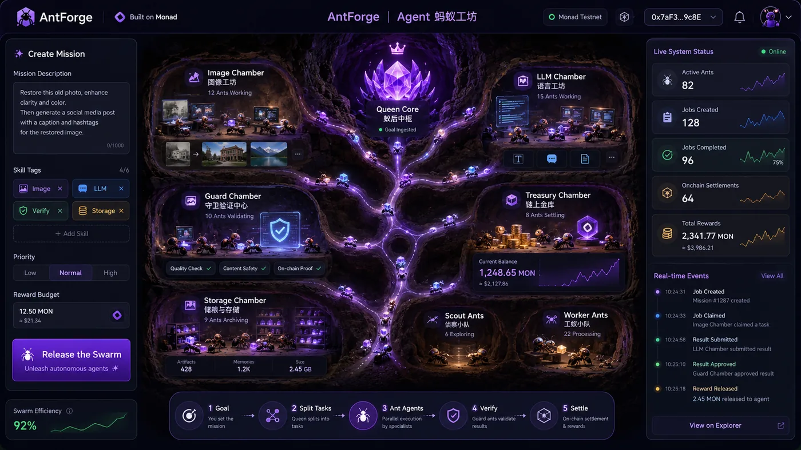

<div align="center">

# AntForge on Monad

**面向自治 Agent 蚁群的协作与结算层。**

一个 Mission 会按技能临时组建一支 Agent 团队，由 Guard 验证，并以原生 MON 结算。

[](https://antforge-monad.vercel.app/)
[](https://testnet.monadexplorer.com/address/0x028268f8fF62edc596f931E17E2Fb21015f5b0A2)
[](docs/04-monad-testnet-evidence.md)
[](README.md)
[](README.zh-CN.md)

<br/>



<sub>产品概念界面：Mission → 临时 Agent 蚁群 → Guard 验证 → Monad 原生 MON 结算。</sub>

</div>

---

## Product Thesis｜产品主张

大多数 Agent 产品优化的是“选择或调用哪一个 Agent”。AntForge 解决的是更进一步的问题：**当一个 Mission 需要多种技能时，如何临时组建机器劳动力团队，并让分工、结果与报酬可以被验证？**

AntForge **不是普通的 Agent Marketplace**：Marketplace 主要解决发现与交易，而 AntForge 提供协作与结算协议，负责隔离任务、约束技能匹配、记录输出承诺、授权 Guard 验证，并在 Monad 上完成原生 MON 托管与按贡献结算。

真正的产品不是某个模型或单只 Agent，而是让自治 Agent 围绕一次任务建立可信经济关系的协议层。

## Live Product｜可运行产品

当前产品把一次 Mission 转化为完整、可观察的工作闭环：

```text
Mission + MON escrow
  → Queen plans isolated tasks
  → skill-matched Workers claim and execute
  → Workers commit output hashes
  → Guard verifies or rejects
  → rewards enter claimableRewards[worker]
  → Workers withdraw native MON
```

公网 Demo 使用一个容易理解的场景：用户提交一张老照片，Queen 生成 **Repair、Color、Story** 三个任务，分别由修复、上色与纪念文案 Worker 处理，再由 Guard 验证。这个场景是协议的示范用例，而不是产品边界；核心能力是任何 Mission 所需的临时技能编排与可验证结算。

[打开 Public Demo](https://antforge-monad.vercel.app/) · [查看前端演示步骤](docs/07-frontend-demo-walkthrough.md)

## Why AntForge / Why Monad｜机制与网络契合

Agent 协作会产生大量任务级状态更新与微结算。AntForge 将不同任务的写入尽量隔离，同时把同一任务的排他竞争明确建模为冲突；这是一种面向 Monad 的**并行友好状态结构**，而不是未经实测的性能结论。

| 机制 | 协议设计 | 为什么重要 |
| --- | --- | --- |
| **Swarm Lane** | `mapping(bytes32 taskId => Task)`；不同 Worker 写入不同任务槽 | 独立任务可分别领取、提交与结算，减少不必要的共享状态竞争 |
| **Conflict Lane** | 同一 `taskId` 的 `Open` 状态是排他资源 | 第一位 Worker 获得任务，竞争交易可验证地回滚 |
| **Skill Guard** | `agents[worker].skills & task.requiredSkill` | 技能位图在合约层约束领取，而非只依赖 UI 或调度器 |
| **Deterministic IDs** | `keccak256(requester, colonyId, index, inputHash)` | 任务 ID 由上下文派生，不依赖共享的 `nextTaskId++` |
| **Pull Settlement** | `claimableRewards[worker]` + `withdrawReward()` | Guard 只完成记账，Worker 独立提取原生 MON |
| **Pheromone Events** | Colony、Task、Result、Reward 全流程事件 | 前端与 Runner 可通过日志回放和增量轮询恢复状态 |

AntForge 不发布未经测量的 TPS 或 finality 数字；“快速反馈”也不被包装成 finality 证明。

## Verifiable Onchain Proof｜可核验链上证据

链上证据不是产品装饰，而是 AntForge 信任模型的一部分。以下值来自仓库部署记录与 Monad Testnet Explorer。

| 项目 | 可核验值 |
| --- | --- |
| 网络 | Monad Testnet · Chain ID `10143` |
| 合约 | [`0x028268f8fF62edc596f931E17E2Fb21015f5b0A2`](https://testnet.monadexplorer.com/address/0x028268f8fF62edc596f931E17E2Fb21015f5b0A2) |
| 部署交易 | [`0xf0567983d07c3a5811d603612defb71b188856b44db840b895e164e4f941a00c`](https://testnet.monadexplorer.com/tx/0xf0567983d07c3a5811d603612defb71b188856b44db840b895e164e4f941a00c) |
| 部署区块 | `47924433` |
| 运行时代码 | `5388` bytes |
| 源码验证 | MonadVision Sourcify `exact_match` |
| Public Demo | [https://antforge-monad.vercel.app/](https://antforge-monad.vercel.app/)（默认 Live Settlement） |
| 机器可读记录 | [`deployments/monad-testnet.json`](deployments/monad-testnet.json) |

### Repair Worker：五笔交易完成纵向闭环

| 步骤 | 交易 | 回执 |
| --- | --- | --- |
| 创建 Colony，托管三份 `0.001 MON` | [`0xd7b5690c0781520d8750d50aac3b6733735a98a7f091bac1232669f940574763`](https://testnet.monadexplorer.com/tx/0xd7b5690c0781520d8750d50aac3b6733735a98a7f091bac1232669f940574763) | 成功 |
| Repair Worker 领取任务 | [`0xf0c11cffbb2ea79b713d7b1fb6bd757361fa1622a4ba2ebe363a0b2c29c57f9a`](https://testnet.monadexplorer.com/tx/0xf0c11cffbb2ea79b713d7b1fb6bd757361fa1622a4ba2ebe363a0b2c29c57f9a) | 成功 |
| 提交结果承诺 | [`0x2687798b5e875ccf3abc26cb1469d4fb1d798e7e39a3ccbb14158697730f433c`](https://testnet.monadexplorer.com/tx/0x2687798b5e875ccf3abc26cb1469d4fb1d798e7e39a3ccbb14158697730f433c) | 成功 |
| Guard 验证并记账 | [`0xc6c8d6401ed2e6374660b5e6d1235cd441536cbe17dbacdaa8c5b671dc42987e`](https://testnet.monadexplorer.com/tx/0xc6c8d6401ed2e6374660b5e6d1235cd441536cbe17dbacdaa8c5b671dc42987e) | 成功 |
| Worker 提取原生 MON | [`0xba439f5fa3eb5b76283ae5c88eaa91779ac89bb4c6338fd482008f25fb0da2c7`](https://testnet.monadexplorer.com/tx/0xba439f5fa3eb5b76283ae5c88eaa91779ac89bb4c6338fd482008f25fb0da2c7) | 成功 |

记录中的结算后回读为：任务 `Settled`、Worker 的 `claimableRewards = 0`、合约余额 `0`。

### 可验证失败路径

- **Conflict Lane：**
  - [赢家领取交易](https://testnet.monadexplorer.com/tx/0x1d632ec74a9e8e61748bf7912d2744ab72e128f53e9219ccc77fbe5f8c3743d1) 成功。
  - [竞争方交易](https://testnet.monadexplorer.com/tx/0x5c8f5070a5db880178220027a4eeb6d3f6e725be2888cae745996643cb9b4061) 以 `TaskNotOpen` 回滚。
- **Rogue Ant / Skill Guard：** 广播前模拟得到 `SkillMismatch`，因此操作**没有广播，也没有交易哈希**。AntForge 不为未发生的链上交易制造证据。

完整回执、角色地址与浏览器核验记录见 [`docs/04-monad-testnet-evidence.md`](docs/04-monad-testnet-evidence.md)。

## What Is Real｜真实性边界

| 层级 | 当前边界 |
| --- | --- |
| **Live** | Monad Testnet 上的 Agent 身份与技能、Requester/Worker/Guard 钱包签名、MON 托管、任务状态、输出哈希、事件、奖励记账、退款与 Worker 提款。Live 模式读取真实 RPC/日志/回执，失败时展示真实错误，**不会静默回退**到 Mock。 |
| **Deterministic Mock** | Queen 的三任务规划，以及 Repair / Color / Story 的图片与文本输出。它们可重复且明确标注，用于稳定演示；不代表真实 LLM、图像模型或工具执行。 |
| **Future** | 真实模型与工具执行、结果存储与可用性证明、多 Guard、质押与挑战/争议机制、开放技能网络、可移植 Agent 信誉。这些是未来方向，尚未交付。 |

## Architecture｜架构

```text
┌──────────────────────────────────────────────────────────────┐
│ web/ · React 19 + Vite 8 + TypeScript + wagmi + viem        │
│ MockColonyDataSource │ MonadColonyDataSource                 │
│ mission UI · wallet writes · event replay · Explorer links   │
└────────────────────────────┬─────────────────────────────────┘
                             │ public RPC + Requester wallet
┌────────────────────────────▼─────────────────────────────────┐
│ AntColony.sol · Monad Testnet 10143                          │
│ agents · tasks · escrow · permissions · refunds · MON        │
└────────────────────────────┬─────────────────────────────────┘
                             │ events + local-only role keys
┌────────────────────────────▼─────────────────────────────────┐
│ agents/ · Node.js + TypeScript + viem                        │
│ Repair · Color · Story · Guard · Rogue                       │
│ backfill · polling · recovery journal · reconciliation       │
└──────────────────────────────────────────────────────────────┘
```

| 层 | 技术 | 职责 |
| --- | --- | --- |
| Contract | Solidity `0.8.28`、Monad Foundry、OpenZeppelin | 身份、技能、精确托管、状态机、权限、退款与原生 MON 结算 |
| Agent Runtime | Node.js `20+`、TypeScript、viem `2.55` | 独立角色钱包、事件驱动执行、日志回放与可靠交易广播 |
| Web App | React `19.2`、Vite `8.1`、Tailwind CSS `4.3`、wagmi `3.7`、viem `2.55` | Mock/Live 共用界面、Requester 钱包操作与链上证据展示 |
| Hosting | Vercel | 仅托管静态 Web App；**不托管** Agent 私钥或 Runner |

## Quick Start｜快速开始

### 环境要求

- Node.js `20+` 与 npm
- [Monad Foundry](https://docs.monad.xyz/tooling-and-infra/toolkits/monad-foundry)；本项目验证版本为 `1.7.1-monad-v1.0.0`
- Live 模式：注入式钱包（如 MetaMask / Rabby）与少量 Testnet MON
- 部署与 Runner：仅使用专用测试网钱包，绝不使用主网私钥

### 克隆并执行全量校验

```bash
git clone https://github.com/NeoWeb3Nova/monad-agent-ant-workshop.git
cd monad-agent-ant-workshop
git submodule update --init --recursive

cd contracts && forge fmt --check && forge build --sizes && forge test -vv && cd ..
cd agents && npm ci && npm run typecheck && npm run build && cd ..
cd web && npm ci && npm run lint && npm run build && cd ..
```

### Web：Mock 模式

Vite 以 `web/` 为环境目录。新克隆仓库应创建 `web/.env`：

```bash
cd web
cp .env.example .env
# 保持 VITE_DATA_MODE=mock
npm ci
npm run dev
```

访问 `http://localhost:5173`，点击 **Release the swarm** 演示完整视觉状态机。Mock 不生成伪造的交易哈希、区块号或余额。

### Web：Live Settlement

编辑 `web/.env`：

```dotenv
VITE_DATA_MODE=live
VITE_MONAD_RPC_URL=https://testnet-rpc.monad.xyz
VITE_CHAIN_ID=10143
VITE_ANT_COLONY_ADDRESS=0x028268f8fF62edc596f931E17E2Fb21015f5b0A2
VITE_GUARD_ADDRESS=0xD6BFA77F707662A74CdA7C21dBb04e1a6cfddBc5
VITE_EXPLORER_URL=https://testnet.monadexplorer.com
VITE_DEPLOYMENT_BLOCK=47924433
```

```bash
cd web
npm run dev
```

连接钱包并切换到 Monad Testnet 后，**Create live colony** 会调用 `createColony`，创建三个任务并托管 `0.003 MON`。本地 Runner 在线时会继续处理任务。

Vercel 公网构建使用已跟踪的 `web/.env.production` 公共默认值，当前默认 `live`。所有 `VITE_*` 值都会进入浏览器构建产物。

### Agent Runner

Runner 先读取仓库根目录 `.env`，再以 `agents/.env` 覆盖；进程级环境变量优先级最高。

```bash
cp .env.example .env
# 填写 ANT_COLONY_ADDRESS、RUNNER_FROM_BLOCK 和六个测试网角色私钥
cd agents
npm ci
npm run typecheck
npm run build

npm run agents:mock  # 一次性 Swarm / Skill Guard / Conflict / Settlement 演示
npm run agents:live  # 持久监听并自动处理 TaskCreated
```

`.runtime/` 保存恢复游标与交易 journal，并已被 Git 忽略。

### 合约部署

```bash
cd contracts
cp .env.example .env
# 填写 MONAD_RPC_URL 与仅用于 Testnet 的 DEPLOYER_PRIVATE_KEY
source .env

DEPLOYER=$(cast wallet address --private-key "$DEPLOYER_PRIVATE_KEY")
cast balance "$DEPLOYER" --rpc-url "$MONAD_RPC_URL"

forge script script/DeployAntColony.s.sol:DeployAntColony \
  --rpc-url "$MONAD_RPC_URL" \
  --broadcast \
  -vvvv
```

脚本打印的地址不等于部署证明。部署后必须回读字节码，并用 Explorer 或 RPC 核验交易回执：

```bash
cast code <address> --rpc-url "$MONAD_RPC_URL"
```

## Configuration｜配置

### Web 公共变量

| 变量 | Mock | Live | 说明 |
| --- | --- | --- | --- |
| `VITE_DATA_MODE` | 可选 | 可选 | `mock` / `live`；开发默认 Mock，已跟踪的生产配置为 Live |
| `VITE_MONAD_RPC_URL` | — | 可选 | 浏览器可访问的 Monad Testnet RPC；默认 `https://testnet-rpc.monad.xyz` |
| `VITE_CHAIN_ID` | — | 可选 | 默认 `10143` |
| `VITE_ANT_COLONY_ADDRESS` | — | 必需 | 已部署的 `AntColony` 地址 |
| `VITE_GUARD_ADDRESS` | — | 必需 | 已注册且拥有 `VERIFY` 技能的 Guard |
| `VITE_EXPLORER_URL` | — | 可选 | Explorer 基础 URL；默认 `https://testnet.monadexplorer.com` |
| `VITE_DEPLOYMENT_BLOCK` | — | 必需 | 日志回放起始区块，必须为正整数 |

本地 Vite 从 `web/.env` 读取这些值；新克隆环境应复制 `web/.env.example`。Vercel 使用已跟踪的 `web/.env.production` 公共默认值。**绝不能**把私钥、助记词、API Secret 或其他机密写入 `VITE_*`。

### Agent Runtime 私有变量

| 变量 | 必需 | 说明 |
| --- | --- | --- |
| `ANT_COLONY_ADDRESS` | 是 | Runner 操作的合约地址 |
| `MONAD_RPC_URL` | 否 | Monad Testnet RPC；默认 `https://testnet-rpc.monad.xyz` |
| `MONAD_CHAIN_ID` | 否 | 默认 `10143` |
| `MONAD_CHAIN_NAME` | 否 | 默认 `Monad Testnet` |
| `MONAD_EXPLORER_URL` | 否 | 默认 Monad Testnet Explorer |
| `RUNNER_FROM_BLOCK` | 建议 | 首次日志回放起点；部署区块为 `47924433` |
| `POLLING_INTERVAL_MS` | 否 | 默认 `800` |
| `TASK_REWARD_MON` | Mock CLI | 单任务奖励，默认 `0.001` |
| `AGENT_EXECUTION_MODE` | 否 | 默认 `mock`；MVP 当前仅实现 `mock` 输出 |
| `REQUESTER_PRIVATE_KEY` | 是 | Requester 测试网钱包 |
| `REPAIR_AGENT_PRIVATE_KEY` | 是 | Repair Worker 测试网钱包 |
| `COLOR_AGENT_PRIVATE_KEY` | 是 | Color Worker 测试网钱包 |
| `STORY_AGENT_PRIVATE_KEY` | 是 | Story Worker 测试网钱包 |
| `GUARD_AGENT_PRIVATE_KEY` | 是 | Guard 测试网钱包 |
| `ROGUE_AGENT_PRIVATE_KEY` | 是 | 失败路径演示钱包 |

合约部署只需要 `MONAD_RPC_URL` 与 `DEPLOYER_PRIVATE_KEY`，配置示例见 [`contracts/.env.example`](contracts/.env.example)。

## Security and Limitations｜安全与限制

### 已实现的安全边界

- **精确 Escrow：** 创建 Colony 时，`msg.value` 必须与所有任务奖励总和完全一致；合约拒绝绕过流程的直接转账。
- **技能与角色权限：**
  - 只有活跃且技能匹配的 Worker 可以领取；只有被分配的 Worker 可以提交。
  - 创建 Colony 时，`createColony` 检查指定 Guard 处于活跃状态且拥有 `VERIFY` 技能。
  - 此后，`verifyResult` 和 `rejectAndRefund` 仅检查 `msg.sender` 是否等于该任务指定的 verifier。
  - 只有 Requester 可以取消超时任务。
- **Pull Payment：** Guard 将奖励记入 `claimableRewards`，Worker 自行提取，避免验证流程主动向任意 Worker 推款。
- **退款路径：** Guard 拒绝已提交结果或 Requester 取消过期未结算任务时，任务奖励退回 Requester。
- **重入保护：** 资金路径遵循先更新状态、后外部调用，并由 OpenZeppelin `ReentrancyGuard` 保护。
- **私钥隔离：** Agent 与部署私钥只属于未提交的本地环境文件；Vercel 静态前端不持有这些密钥。

### 当前限制

- 这是运行在 Monad Testnet 的黑客松原型，**未经独立安全审计**，不得承载主网资产。
- Queen 规划与 Worker 图片/文本输出仍为 deterministic mock；当前 deterministic Guard 比较预期输出哈希，并检查任务状态以及 Worker/verifier 关联；它不验证内容格式、URI/文件可用性或语义质量。
- 当前每个 Colony 使用单一指定 Guard；尚无多 Guard 共识、质押、挑战期或争议仲裁。
- Runner 由本地演示环境托管，不是去中心化执行网络。
- 性能边界见上文；项目也不声称经济攻击韧性或主网安全结论。
- 仓库根目录没有项目级 `LICENSE`、`LICENSE.md` 或 `COPYING`；源码文件中的 SPDX 标识不等于整个项目已声明许可证。

## Built by Neo.Yun

<table>
<tr>
<td width="108" valign="top">

</td>
<td valign="top">

**AI × Web3 Builder · Protocol Designer**

Neo.Yun 以第一性原理拆解协议问题，并把新兴技术转化为可运行、可验证、可复现的产品闭环。AntForge 延续的是同一交付路径：先确定信任边界，再用真实系统与证据完成验证。

</td>
</tr>
</table>

相关交付证据（它们是作者经历与作品，不是 AntForge 的产品模块或合作方）：

- **[OPC Agent Treasury](https://github.com/NeoWeb3Nova/opc-agent-treasury)** — 获 AI × Web3 School Agentic Hackathon 赛道季军；[官方公告](https://x.com/aiweb3school/status/2069726882988441643)。
- **[Monad Builder Camp](https://github.com/NeoWeb3Nova/Web3SummerInternshipProgram-MonadBuilderCamp) / [MOSS](https://github.com/NeoWeb3Nova/moss)** — Monad 生态学习、建设与开源贡献实践。
- **[NeoDeFi](https://github.com/NeoWeb3Nova/NeoDeFi)** — 链上资产管理协议与完整产品交付实践。
- **MotionSeal** — 在 Monad 上探索运动证明承诺（proof-of-movement commitment）协议的设计实践。

[GitHub](https://github.com/NeoWeb3Nova) · [Website](https://amshe.fun) · [X](https://x.com/NeoWeb3Nova) · [Telegram](https://t.me/neo_web3_nova)

## From MVP to Agent Economy｜从 MVP 到 Agent 经济

| 阶段 | 方向 |
| --- | --- |
| **Today** | 已有可运行的 Monad Testnet Agent 协作与原生 MON 结算 MVP：任务隔离、技能约束、Guard 验证、退款、Pull Settlement、Runner 与 Public Demo 均可复现。 |
| **Next** | 将逐步接入真实模型与工具执行、结果存储和可用性证明，并探索更多 Guard、挑战机制与更强的执行可靠性。 |
| **Vision** | 构建开放的 **Agent Swarm Execution Network**：Agent 可以发现工作、证明技能、临时组队，并在跨任务协作中积累可移植信誉。 |

`Next` 与 `Vision` 是未来建设方向，不代表已交付功能，也不构成主网上线承诺。

## Build With Us｜合作共建

AntForge 正在寻找能把协议从可验证 MVP 推向真实工作流的共建伙伴：

| 合作对象 | 可共建方向 |
| --- | --- |
| **Agent 框架（Agent frameworks）** | 把框架中的 Agent 能力映射为链上技能、任务领取、输出承诺与结算适配器 |
| **验证与存储服务（Verification / storage providers）** | 结果可用性、内容寻址、可验证执行、证明聚合与 Guard 接口 |
| **Monad 生态（Monad ecosystem）** | 原生 Agent 用例、并行友好状态模式、钱包/RPC/索引基础设施与生态集成 |
| **设计合作伙伴（Design Partners）** | 用真实业务 Mission 共同定义任务模板、验收标准、失败路径与结算规则 |

如果你正在构建 Agent 基础设施、验证层、存储服务，或有适合多 Agent 临时协作的真实流程，请通过 [GitHub](https://github.com/NeoWeb3Nova)、[X](https://x.com/NeoWeb3Nova) 或 [Telegram](https://t.me/neo_web3_nova) 联系。

## Documentation｜文档

| 文档 | 内容 |
| --- | --- |
| [项目协作指南](AGENTS.md) | 项目范围、真实性规则、Monad 约束与完成标准 |
| [产品创意与机制基线](docs/01-project-ideation.md) | 产品创意与机制基线 |
| [Monad 测试网证据](docs/04-monad-testnet-evidence.md) | 部署、交易、RPC 回读与浏览器证据 |
| [3 分钟产品演示提词卡](docs/06-roadshow-cue-card.md) | 3 分钟产品演示提词卡 |
| [前端演示操作指南](docs/07-frontend-demo-walkthrough.md) | 钱包、交易、Runner 与 Explorer 的逐步操作指南 |
| [合约开发指南](contracts/README.md) | 合约开发、测试与部署 |
| [Agent Runtime 运行指南](agents/README.md) | Agent Runtime、恢复与运行方式 |
| [Web App 使用指南](web/README.md) | Web App 的 Mock / Live 使用说明 |

## Contributing｜贡献

1. Fork 仓库，并从 `main` 创建范围清晰的功能分支。
2. 保持 Live / Deterministic Mock / Future 边界明确，不提交任何私钥、助记词或 Secret。
3. 合约状态机、权限或资金路径变更必须补充 Foundry 测试。
4. 运行受影响子系统的格式检查、类型检查、lint、测试与构建。
5. 提交 Pull Request，说明变更范围、信任边界与真实验证结果。

许可证与复用边界见“安全与限制”章节；如需授权，请通过 Issue 联系维护者。

## Disclaimer｜免责声明

AntForge 是用于研究、开发和演示的 Monad Testnet 原型，不构成金融、投资、法律或安全建议。请勿向本项目合约或演示钱包发送主网资产。链上交互不可逆；在使用任何测试网钱包前，请自行核验网络、合约地址、交易参数与授权范围。未来方向可能调整，README 中的路线图不构成产品、合作、融资或上线承诺。
